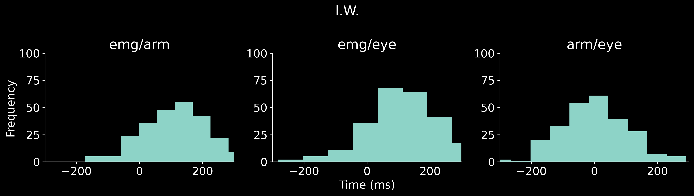
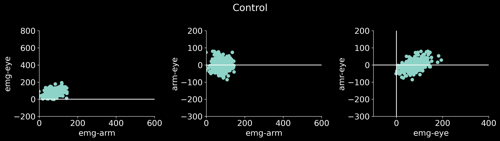
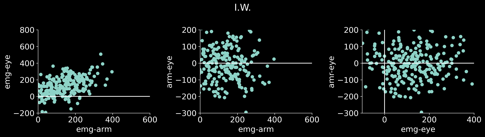
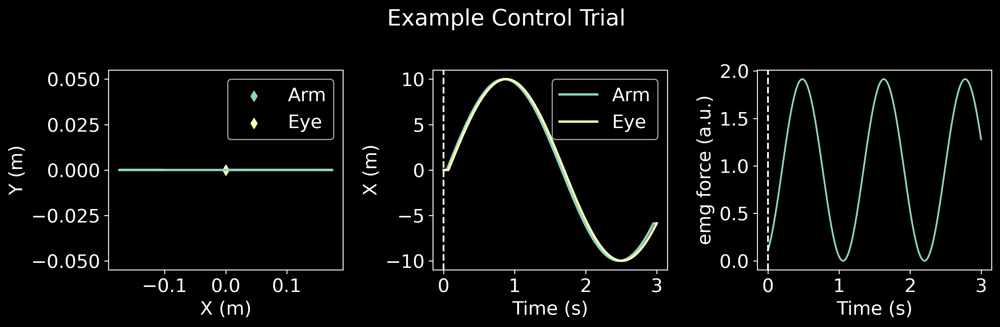

# Role of arm proprioception in calibrating the arm-eye temporal coordination - Vercher, Gauthier, Cole, and Blouin (1997)

Simulate participants from study using given parameters. 

## Figures 1 and 2 

## Figure 3 

## Simulate behavior 

